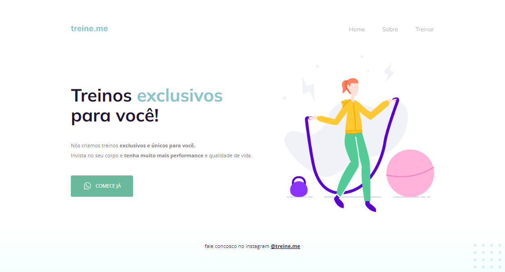

  

	
<h4 align="center"> 
	🚀 Projeto 02 | Stage 02 - Explorer
</h4>

  

  
  
  
  
  <a href=""> ▶️ Visualizar Deploy </a>

<h2 align=left> 💻 Sobre o projeto </h3>

 Página feita durante o programa <strong>Explorer</strong> da <a href="https://www.rocketseat.com.br/"> <strong>Rocketseat</strong> </a>. É o segundo projeto do nível 2 do programa, onde construímos uma página simples para demonstração de conceitos de HTML e CSS, como HTML semântico e flexbox.

  
<h2 align=left> 🛠 Tecnologias utilizadas </h3>

  
  

<h2 align=left> 🎨 Layout </h2>
<a href="https://www.figma.com/file/2a3x8m5K6ThBxtO8FcC8Zi/Explorer---Projeto-02-(Copy)?node-id=1%3A5"> Visualizar no Figma </a>

<h4>💻 Desktop </h4>

